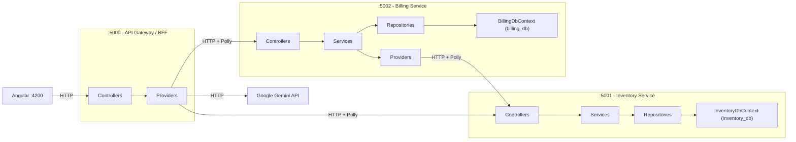

# CODEBASE.md — Dependency Map

This file is the single source of truth for architectural dependencies between layers and services.
Update this file whenever adding new layers or changing service relationships.

## Service Communication

## Layer Rules

| Layer        | Allowed Dependencies     | Forbidden                 |
| ------------ | ------------------------ | ------------------------- |
| Controllers  | Services only            | Repositories, Providers   |
| Services     | Repositories + Providers | DbContext directly        |
| Repositories | DbContext only           | Services, Providers, HTTP |
| Providers    | HttpClient only          | DbContext, Repositories   |

## Port Map

| Service           | Port | DB                  |
| ----------------- | ---- | ------------------- |
| API Gateway       | 5000 | None (proxy)        |
| Inventory Service | 5001 | inventory_db (5432) |
| Billing Service   | 5002 | billing_db (5432)   |
| Angular Frontend  | 4200 | None (API only)     |
| PostgreSQL        | 5432 | -                   |
