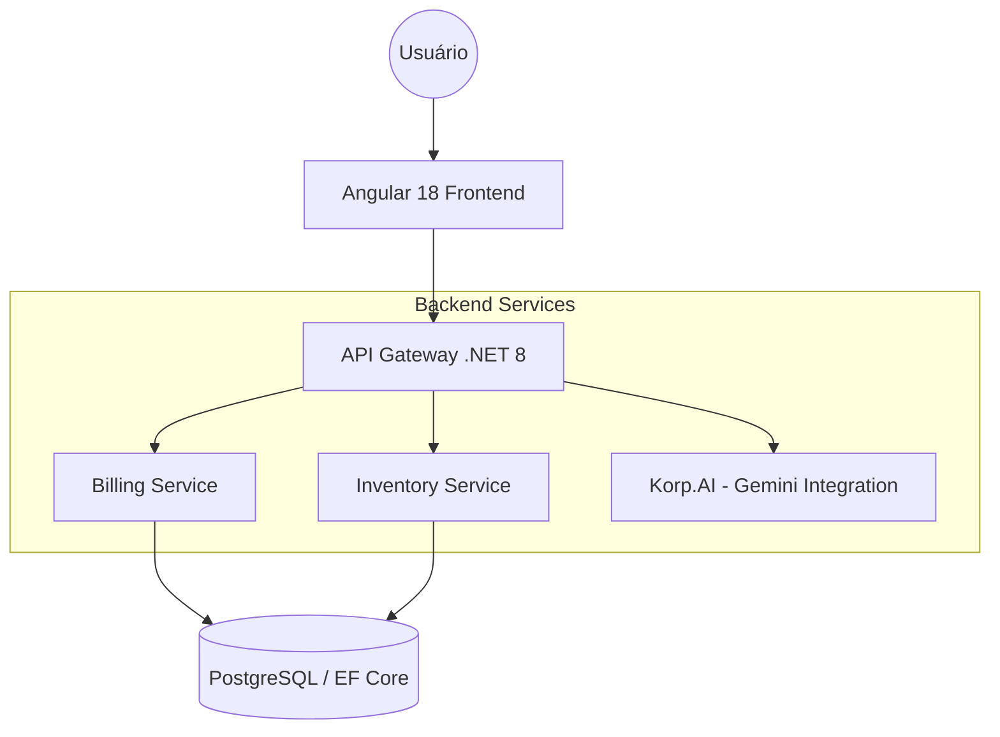

# Korp Note System | Technical Assessment

Bem-vindo ao **Korp Note System**, uma solução de faturamento atômico e gestão de produtos desenvolvida como parte do processo de avaliação técnica da **Korp**.

Este projeto demonstra a implementação de um ecossistema full-stack moderno, focado em alta performance, segurança rigorosa e experiência do usuário premium.

---

## Arquitetura do Sistema

O sistema foi concebido sob a filosofia de microsserviços e responsabilidade única (SRP), garantindo escalabilidade e isolamento de falhas.



---

## Documentação Especializada

Para uma imersão técnica profunda em cada camada do sistema, consulte os guias dedicados:

- **[Backend & Engenharia de Dados](./backend/README.md)**: Detalhes sobre a arquitetura de microsserviços, segurança (CSP), atomicidade de transações e infraestrutura Docker.
- **[Frontend & UX/UI Pro Max](./frontend/README.md)**: Detalhes sobre a gestão de estado com Angular Signals, design system customizado e integração com Inteligência Artificial.

---

## Como Executar (Quick Start)

Para subir o ecossistema completo, siga os passos abaixo:

1. **Backend (Microsserviços + DB)**:

   ```bash
   # Na raiz do projeto
   docker-compose up --build
   ```

   _Isso iniciará o Gateway (5000), Inventory (5001), Billing (5002) e o PostgreSQL._

2. **Frontend (Angular)**:
   ```bash
   cd frontend
   npm install
   npm start
   ```
   _O frontend estará disponível em `http://localhost:4200`._

---

## Requisitos do Teste Técnico (Resumo)

- [x] **Faturamento Atômico**: Garante que o estoque é debitado de forma consistente durante a impressão, com suporte a rollback automático em caso de falha.
- [x] **State Management**: Uso de Signals no Angular para reatividade de alta performance.
- [x] **Clean Code & SOLID**: Arquitetura baseada em Providers e serviços especializados.
- [x] **Integração com IA**: "Korp.AI" utilizando Google Gemini para auxílio na montagem de notas.
- [x] **Segurança**: Headers de segurança (CSP, HSTS condicional) e validação de concorrência.

---

## 📋 Próximos Passos (Backlog Técnico)

Estes itens estão mapeados para garantir 100% de conformidade com os requisitos obrigatórios e opcionais do teste técnico:

1.  **Relatório de Detalhamento Técnico (`TECH_REPORT.md`)**: Criação do documento obrigatório (Pág. 1 do PDF) respondendo às perguntas sobre Angular LifeCycles, RxJS, LINQ e tratamento de erros.
2.  **Segurança de Estado (Business Logic)**: Impedir a adição ou remoção de itens em notas que já possuem o status `Closed` (pós-impressão).
3.  **Feedback Visual (Toasts/Notificações)**: Implementar um sistema de notificações no frontend para fornecer feedback imediato de sucesso ou erro (exigência do teste).
4.  **Concorrência Otimista (RowVersion)**: Implementar `Timestamp` no modelo de `Product` para gestão de conflitos de estoque.
5.  **Idempotência Avançada**: Persistência de chaves de idempotência para garantir resiliência em falhas de rede.

---

**Desenvolvido com Antigravity AI**
